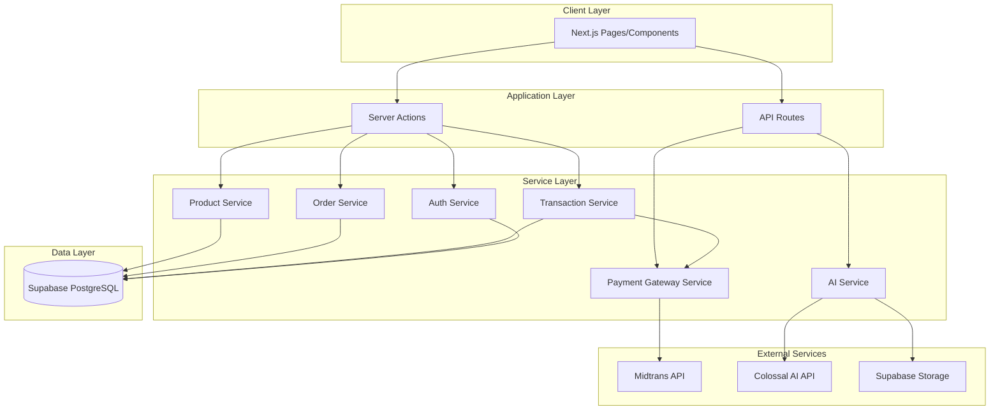

# Design Document

## Overview

SALAMAN is a Next.js-based B2B marketplace that implements a trustless escrow system using AI verification. The application follows a modular monolith architecture where all components exist within a single Next.js repository, leveraging App Router for routing, Server Actions for backend logic, and Supabase for data persistence.

The core innovation is the automated escrow release mechanism: when a buyer receives products and uploads delivery proof photos, the Colossal AI Vision API analyzes the images to verify product authenticity. If verification passes, funds are automatically released to the supplier. If verification fails, a dispute flow is triggered.

The system integrates with two critical external services:
- **Midtrans Snap API** for payment processing and escrow fund management
- **Colossal AI Vision API** for object detection and product verification

## Architecture

### High-Level Architecture



### Architecture Principles

1. **Modular Monolith**: All code resides in a single Next.js repository with clear module boundaries
2. **Server-First**: Business logic executes in Server Actions to minimize client-side complexity
3. **Type Safety**: TypeScript interfaces ensure type safety across all layers
4. **Separation of Concerns**: Clear separation between UI components, business logic, and data access
5. **External Service Abstraction**: Third-party APIs are wrapped in service modules for testability

### Technology Stack

- **Framework**: Next.js 15 (App Router)
- **Language**: TypeScript 5.x
- **Styling**: Tailwind CSS + Shadcn/UI
- **Icons**: Lucide React
- **Database**: Supabase (PostgreSQL)
- **Authentication**: Supabase Auth
- **File Storage**: Supabase Storage
- **Payment Gateway**: Midtrans Snap API (Sandbox)
- **AI Vision**: Colossal AI Vision API
- **Form Handling**: React Hook Form + Zod validation
- **State Management**: React Server Components + URL state

## Components and Interfaces

### Frontend Components

#### Page Components (app/)
- `/` - Landing page with marketplace overview
- `/auth/login` - User authentication
- `/auth/register` - User registration with role selection
- `/marketplace` - Product catalog with search and filters
- `/product/[id]` - Product detail page
- `/cart` - Shopping cart
- `/checkout` - Order confirmation and payment
- `/orders` - Order list (buyer view)
- `/orders/[id]` - Order detail with delivery proof upload
- `/supplier/dashboard` - Supplier dashboard with sales metrics
- `/supplier/products` - Supplier product management
- `/supplier/orders` - Supplier order fulfillment
- `/transactions` - Transaction history
- `/transactions/[id]` - Transaction detail with AI verification results
- `/disputes/[id]` - Dispute resolution interface

#### UI Components (components/ui/)
- Shadcn/UI components: Button, Card, Input, Select, Dialog, Toast, Badge, Table, Form
- Custom components built on Shadcn primitives

#### Feature Components (components/)
- `ProductCard` - Product display in catalog
- `ProductGrid` - Grid layout for products
- `SearchBar` - Product search with filters
- `CartItem` - Individual cart item
- `OrderSummary` - Order details display
- `DeliveryProofUpload` - Image upload for delivery verification
- `AIVerificationResult` - Display AI analysis results
- `TransactionStatusBadge` - Visual status indicator
- `DisputeForm` - Dispute submission interface
- `SupplierStats` - Dashboard metrics display

### Backend Services

#### Server Actions (actions/)

**transaction.ts**
```typescript
// Create new order
createOrder(userId: string, items: CartItem[]): Promise<Order>

// Process payment callback
handlePaymentNotification(notification: MidtransNotification): Promise<void>

// Upload delivery proof
uploadDeliveryProof(orderId: string, imageFile: File): Promise<string>

// Trigger AI verification
verifyDelivery(orderId: string, imageUrl: string): Promise<VerificationResult>

// Release funds to supplier
releaseFunds(transactionId: string): Promise<void>

// Create dispute
createDispute(transactionId: string, reason: string): Promise<Dispute>

// Resolve dispute
resolveDispute(disputeId: string, resolution: DisputeResolution): Promise<void>
```

**product.ts**
```typescript
// Get products with filters
getProducts(filters: ProductFilters): Promise<Product[]>

// Search products
searchProducts(query: string): Promise<Product[]>

// Get product by ID
getProductById(id: string): Promise<Product>

// Create product (supplier)
createProduct(data: ProductInput): Promise<Product>

// Update product (supplier)
updateProduct(id: string, data: ProductInput): Promise<Product>

// Deactivate product
deactivateProduct(id: string): Promise<void>
```

**order.ts**
```typescript
// Get buyer orders
getBuyerOrders(userId: string): Promise<Order[]>

// Get supplier orders
getSupplierOrders(supplierId: string): Promise<Order[]>

// Update order status
updateOrderStatus(orderId: string, status: OrderStatus): Promise<void>

// Add tracking information
addTrackingInfo(orderId: string, tracking: string): Promise<void>
```

**auth.ts**
```typescript
// Register new user
registerUser(data: RegisterInput): Promise<User>

// Login user
loginUser(email: string, password: string): Promise<Session>

// Get current user
getCurrentUser(): Promise<User | null>

// Logout user
logoutUser(): Promise<void>
```

#### Service Modules (lib/)

**supabase.ts**
- Supabase client initialization
- Database query helpers
- Storage helpers

**colossal.ts**
```typescript
interface ColossalAIService {
  // Detect objects in image
  detectObjects(imageUrl: string): Promise<DetectionResult>
  
  // Verify product match
  verifyProduct(imageUrl: string, expectedCategory: string): Promise<{
    isValid: boolean
    confidence: number
    detectedObjects: string[]
  }>
}
```

**midtrans.ts**
```typescript
interface MidtransService {
  // Create Snap transaction
  createTransaction(order: Order): Promise<{
    token: string
    redirectUrl: string
  }>
  
  // Verify notification signature
  verifyNotification(notification: MidtransNotification): boolean
  
  // Get transaction status
  getTransactionStatus(orderId: string): Promise<TransactionStatus>
}
```

**utils.ts**
- Common utility functions
- Image validation helpers
- Currency formatting
- Date formatting

## Data Models

### Database Schema

#### users
```sql
CREATE TABLE users (
  id UUID PRIMARY KEY DEFAULT uuid_generate_v4(),
  email VARCHAR(255) UNIQUE NOT NULL,
  password_hash VARCHAR(255) NOT NULL,
  role VARCHAR(20) NOT NULL CHECK (role IN ('buyer', 'supplier')),
  business_name VARCHAR(255) NOT NULL,
  phone VARCHAR(50),
  address TEXT,
  created_at TIMESTAMP DEFAULT NOW(),
  updated_at TIMESTAMP DEFAULT NOW()
);

CREATE INDEX idx_users_email ON users(email);
CREATE INDEX idx_users_role ON users(role);
```

#### products
```sql
CREATE TABLE products (
  id UUID PRIMARY KEY DEFAULT uuid_generate_v4(),
  supplier_id UUID NOT NULL REFERENCES users(id),
  name VARCHAR(255) NOT NULL,
  description TEXT,
  category VARCHAR(100) NOT NULL,
  price DECIMAL(12, 2) NOT NULL,
  unit VARCHAR(50) NOT NULL,
  image_urls TEXT[],
  is_active BOOLEAN DEFAULT true,
  created_at TIMESTAMP DEFAULT NOW(),
  updated_at TIMESTAMP DEFAULT NOW()
);

CREATE INDEX idx_products_supplier ON products(supplier_id);
CREATE INDEX idx_products_category ON products(category);
CREATE INDEX idx_products_active ON products(is_active);
```

#### orders
```sql
CREATE TABLE orders (
  id UUID PRIMARY KEY DEFAULT uuid_generate_v4(),
  buyer_id UUID NOT NULL REFERENCES users(id),
  supplier_id UUID NOT NULL REFERENCES users(id),
  status VARCHAR(50) NOT NULL CHECK (status IN ('PENDING', 'PAID', 'SHIPPED', 'DELIVERED', 'COMPLETED', 'CANCELLED')),
  total_amount DECIMAL(12, 2) NOT NULL,
  tracking_number VARCHAR(255),
  notes TEXT,
  created_at TIMESTAMP DEFAULT NOW(),
  updated_at TIMESTAMP DEFAULT NOW()
);

CREATE INDEX idx_orders_buyer ON orders(buyer_id);
CREATE INDEX idx_orders_supplier ON orders(supplier_id);
CREATE INDEX idx_orders_status ON orders(status);
```

#### order_items
```sql
CREATE TABLE order_items (
  id UUID PRIMARY KEY DEFAULT uuid_generate_v4(),
  order_id UUID NOT NULL REFERENCES orders(id) ON DELETE CASCADE,
  product_id UUID NOT NULL REFERENCES products(id),
  product_name VARCHAR(255) NOT NULL,
  product_category VARCHAR(100) NOT NULL,
  quantity INTEGER NOT NULL,
  unit_price DECIMAL(12, 2) NOT NULL,
  subtotal DECIMAL(12, 2) NOT NULL,
  created_at TIMESTAMP DEFAULT NOW()
);

CREATE INDEX idx_order_items_order ON order_items(order_id);
```

#### transactions
```sql
CREATE TABLE transactions (
  id UUID PRIMARY KEY DEFAULT uuid_generate_v4(),
  order_id UUID NOT NULL REFERENCES orders(id),
  status VARCHAR(50) NOT NULL CHECK (status IN ('PENDING', 'HELD', 'RELEASED', 'DISPUTED', 'REFUNDED')),
  amount DECIMAL(12, 2) NOT NULL,
  midtrans_transaction_id VARCHAR(255),
  midtrans_order_id VARCHAR(255),
  payment_type VARCHAR(50),
  payment_status VARCHAR(50),
  delivery_proof_url TEXT,
  ai_verification_result JSONB,
  ai_verification_status VARCHAR(50),
  created_at TIMESTAMP DEFAULT NOW(),
  updated_at TIMESTAMP DEFAULT NOW()
);

CREATE INDEX idx_transactions_order ON transactions(order_id);
CREATE INDEX idx_transactions_status ON transactions(status);
CREATE INDEX idx_transactions_midtrans ON transactions(midtrans_order_id);
```

#### disputes
```sql
CREATE TABLE disputes (
  id UUID PRIMARY KEY DEFAULT uuid_generate_v4(),
  transaction_id UUID NOT NULL REFERENCES transactions(id),
  reason TEXT NOT NULL,
  status VARCHAR(50) NOT NULL CHECK (status IN ('OPEN', 'UNDER_REVIEW', 'RESOLVED')),
  resolution VARCHAR(50) CHECK (resolution IN ('RELEASE_FUNDS', 'REFUND_BUYER', 'PARTIAL_REFUND')),
  resolution_notes TEXT,
  created_at TIMESTAMP DEFAULT NOW(),
  resolved_at TIMESTAMP
);

CREATE INDEX idx_disputes_transaction ON disputes(transaction_id);
CREATE INDEX idx_disputes_status ON disputes(status);
```

### TypeScript Interfaces

```typescript
// types/index.ts

export type UserRole = 'buyer' | 'supplier'

export interface User {
  id: string
  email: string
  role: UserRole
  businessName: string
  phone?: string
  address?: string
  createdAt: Date
  updatedAt: Date
}

export interface Product {
  id: string
  supplierId: string
  name: string
  description?: string
  category: string
  price: number
  unit: string
  imageUrls: string[]
  isActive: boolean
  createdAt: Date
  updatedAt: Date
}

export type OrderStatus = 'PENDING' | 'PAID' | 'SHIPPED' | 'DELIVERED' | 'COMPLETED' | 'CANCELLED'

export interface Order {
  id: string
  buyerId: string
  supplierId: string
  status: OrderStatus
  totalAmount: number
  trackingNumber?: string
  notes?: string
  items: OrderItem[]
  createdAt: Date
  updatedAt: Date
}

export interface OrderItem {
  id: string
  orderId: string
  productId: string
  productName: string
  productCategory: string
  quantity: number
  unitPrice: number
  subtotal: number
}

export type TransactionStatus = 'PENDING' | 'HELD' | 'RELEASED' | 'DISPUTED' | 'REFUNDED'

export interface Transaction {
  id: string
  orderId: string
  status: TransactionStatus
  amount: number
  midtransTransactionId?: string
  midtransOrderId?: string
  paymentType?: string
  paymentStatus?: string
  deliveryProofUrl?: string
  aiVerificationResult?: AIVerificationResult
  aiVerificationStatus?: string
  createdAt: Date
  updatedAt: Date
}

export interface AIVerificationResult {
  isValid: boolean
  confidence: number
  detectedObjects: Array<{
    label: string
    confidence: number
  }>
  expectedCategory: string
  timestamp: Date
}

export type DisputeStatus = 'OPEN' | 'UNDER_REVIEW' | 'RESOLVED'
export type DisputeResolution = 'RELEASE_FUNDS' | 'REFUND_BUYER' | 'PARTIAL_REFUND'

export interface Dispute {
  id: string
  transactionId: string
  reason: string
  status: DisputeStatus
  resolution?: DisputeResolution
  resolutionNotes?: string
  createdAt: Date
  resolvedAt?: Date
}
```

## API Integration Strategy

### Colossal AI Vision API Integration

**Endpoint**: `https://api.colossal.id/v1/vision/detect`

**Authentication**: API Key in header

**Request Flow**:
1. Buyer uploads delivery proof image
2. Image is stored in Supabase Storage
3. Public URL is generated
4. Server Action calls Colossal AI with image URL and expected product category
5. AI returns detected objects with confidence scores
6. System compares detected objects against expected category
7. If confidence > 70% and category matches, verification passes

**Request Example**:
```typescript
const response = await fetch('https://api.colossal.id/v1/vision/detect', {
  method: 'POST',
  headers: {
    'Authorization': `Bearer ${process.env.COLOSSAL_API_KEY}`,
    'Content-Type': 'application/json'
  },
  body: JSON.stringify({
    image_url: deliveryProofUrl,
    categories: [expectedCategory]
  })
})
```

**Response Example**:
```json
{
  "detections": [
    {
      "label": "chicken",
      "confidence": 0.92,
      "bounding_box": {...}
    }
  ],
  "processing_time_ms": 234
}
```

**Error Handling**:
- Retry up to 3 times with exponential backoff (1s, 2s, 4s)
- If all retries fail, mark transaction for manual review
- Log all API errors for debugging

### Midtrans Snap API Integration

**Snap Token Creation**: `https://app.sandbox.midtrans.com/snap/v1/transactions`

**Authentication**: Server Key (Base64 encoded)

**Request Flow**:
1. Buyer confirms order at checkout
2. Server Action creates Midtrans transaction
3. Midtrans returns Snap token
4. Frontend displays Midtrans Snap popup
5. Buyer completes payment
6. Midtrans sends notification to webhook
7. System verifies notification and updates transaction status

**Request Example**:
```typescript
const auth = Buffer.from(process.env.MIDTRANS_SERVER_KEY + ':').toString('base64')

const response = await fetch('https://app.sandbox.midtrans.com/snap/v1/transactions', {
  method: 'POST',
  headers: {
    'Authorization': `Basic ${auth}`,
    'Content-Type': 'application/json'
  },
  body: JSON.stringify({
    transaction_details: {
      order_id: order.id,
      gross_amount: order.totalAmount
    },
    customer_details: {
      email: buyer.email,
      first_name: buyer.businessName
    }
  })
})
```

**Webhook Notification Handling**:
```typescript
// API Route: /api/webhooks/midtrans
export async function POST(request: Request) {
  const notification = await request.json()
  
  // Verify signature
  const isValid = verifyMidtransSignature(notification)
  if (!isValid) {
    return Response.json({ error: 'Invalid signature' }, { status: 401 })
  }
  
  // Update transaction based on status
  if (notification.transaction_status === 'settlement') {
    await updateTransactionStatus(notification.order_id, 'HELD')
  }
  
  return Response.json({ status: 'ok' })
}
```


## Correctness Properties

*A property is a characteristic or behavior that should hold true across all valid executions of a system-essentially, a formal statement about what the system should do. Properties serve as the bridge between human-readable specifications and machine-verifiable correctness guarantees.*

### Search and Discovery Properties

**Property 1: Search result relevance**
*For any* search query and product catalog, all returned products should match the search terms in their name, description, or category.
**Validates: Requirements 1.2**

**Property 2: Category filter correctness**
*For any* selected category and product catalog, all filtered products should belong to the selected category.
**Validates: Requirements 1.4**

**Property 3: Product display completeness**
*For any* product, the rendered product detail view should contain name, description, price, supplier name, and all available images.
**Validates: Requirements 1.3**

### Order and Payment Properties

**Property 4: Order creation with pending status**
*For any* cart contents, creating an order should result in a new order with status PENDING and all cart items preserved.
**Validates: Requirements 2.1, 2.5**

**Property 5: Payment success triggers escrow**
*For any* order, when payment gateway confirms successful payment, the transaction status should transition to HELD.
**Validates: Requirements 2.3**

**Property 6: Payment failure preserves order state**
*For any* order in PENDING status, a failed payment attempt should not change the order status.
**Validates: Requirements 2.4**

### Supplier Order Management Properties

**Property 7: Supplier order visibility**
*For any* supplier, querying their orders should return all orders where they are the supplier, regardless of status.
**Validates: Requirements 3.2**

**Property 8: Shipping status update triggers notification**
*For any* order, when a supplier marks it as shipped, the order status should update and the buyer should receive a notification.
**Validates: Requirements 3.3**

**Property 9: Tracking information persistence**
*For any* order, when tracking information is added, it should be stored and retrievable by both buyer and supplier.
**Validates: Requirements 3.4**

### Delivery Verification Properties

**Property 10: Image format and size validation**
*For any* uploaded file, the system should accept it if and only if it is in JPEG, PNG, or WebP format and under 5MB in size.
**Validates: Requirements 4.2**

**Property 11: Image upload triggers AI verification**
*For any* successful delivery proof upload, the AI verification process should be automatically triggered.
**Validates: Requirements 4.5**

**Property 12: Image storage and association**
*For any* uploaded delivery proof, the image should be stored in Supabase Storage and the URL should be associated with the correct transaction.
**Validates: Requirements 4.3**

### AI Verification Properties

**Property 13: AI verification confidence threshold**
*For any* AI verification result, the system should mark it as VALID if and only if the confidence score is above 70% and the detected object matches the expected category.
**Validates: Requirements 5.3**

**Property 14: Valid verification releases funds**
*For any* transaction with VALID AI verification, the transaction status should automatically transition to RELEASED and funds should be transferred to the supplier.
**Validates: Requirements 5.5**

**Property 15: Invalid verification creates dispute**
*For any* transaction with INVALID AI verification, the system should automatically create a dispute and update transaction status to DISPUTED.
**Validates: Requirements 6.1**

### Dispute Management Properties

**Property 16: Disputed funds remain held**
*For any* transaction in DISPUTED status, the escrowed funds should remain held and not be released automatically.
**Validates: Requirements 6.2**

**Property 17: Dispute notification to both parties**
*For any* newly created dispute, both the buyer and supplier should receive notifications.
**Validates: Requirements 6.3**

### Product Management Properties

**Property 18: Product creation completeness**
*For any* new product created by a supplier, all required fields (name, description, price, category, unit) should be stored in the database.
**Validates: Requirements 7.1**

**Property 19: Product deactivation preserves history**
*For any* deactivated product, it should be hidden from marketplace searches but remain accessible in historical order data.
**Validates: Requirements 7.4**

### Authentication Properties

**Property 20: Email uniqueness**
*For any* registration attempt, the system should reject it if the email already exists in the database.
**Validates: Requirements 8.1, 8.2**

**Property 21: Invalid credentials rejection**
*For any* login attempt with incorrect email or password, the system should reject authentication and not create a session.
**Validates: Requirements 8.4**

**Property 22: Role-based access control**
*For any* authenticated user accessing a protected route, the system should grant access if and only if the user's role has permission for that route.
**Validates: Requirements 8.5**

### Transaction History Properties

**Property 23: Transaction history completeness**
*For any* buyer, querying their transaction history should return all transactions where they are the buyer, ordered by date.
**Validates: Requirements 9.1**

**Property 24: Transaction detail completeness**
*For any* transaction, the detail view should display order details, payment status, delivery status, and AI verification results if available.
**Validates: Requirements 9.2**

### Payment Integration Properties

**Property 25: Midtrans notification signature verification**
*For any* payment notification from Midtrans, the system should verify the signature before processing the notification.
**Validates: Requirements 11.5**

**Property 26: Payment success updates transaction**
*For any* successful payment notification from Midtrans, the system should update the transaction status to HELD and record payment details.
**Validates: Requirements 11.3**

### Error Handling Properties

**Property 27: AI API retry with exponential backoff**
*For any* failed Colossal AI API call, the system should retry up to 3 times with exponential backoff (1s, 2s, 4s).
**Validates: Requirements 12.1**

**Property 28: Failed verification triggers manual review**
*For any* AI verification that fails after all retries, the transaction should be marked for manual review.
**Validates: Requirements 12.2**

## Error Handling

### Error Categories

1. **Validation Errors**
   - Invalid user input (email format, password strength)
   - Invalid file uploads (size, format)
   - Invalid product data
   - Response: Return user-friendly error messages, maintain form state

2. **Authentication Errors**
   - Invalid credentials
   - Expired sessions
   - Unauthorized access attempts
   - Response: Redirect to login, clear session, log security events

3. **External API Errors**
   - Colossal AI API failures
   - Midtrans API failures
   - Network timeouts
   - Response: Retry with exponential backoff, fallback to manual review, notify administrators

4. **Database Errors**
   - Connection failures
   - Constraint violations
   - Query timeouts
   - Response: Log errors, return generic error to user, maintain data consistency

5. **Business Logic Errors**
   - Insufficient inventory
   - Invalid state transitions
   - Duplicate operations
   - Response: Return specific error messages, prevent invalid operations

### Error Handling Strategy

**Client-Side**:
- Form validation using Zod schemas
- Display inline error messages
- Toast notifications for async operations
- Loading states during API calls

**Server-Side**:
- Try-catch blocks in all Server Actions
- Structured error logging with context
- Transaction rollbacks on failures
- Graceful degradation for non-critical features

**External API Resilience**:
```typescript
async function callWithRetry<T>(
  fn: () => Promise<T>,
  maxRetries: number = 3,
  baseDelay: number = 1000
): Promise<T> {
  for (let i = 0; i < maxRetries; i++) {
    try {
      return await fn()
    } catch (error) {
      if (i === maxRetries - 1) throw error
      await new Promise(resolve => setTimeout(resolve, baseDelay * Math.pow(2, i)))
    }
  }
  throw new Error('Max retries exceeded')
}
```

**Logging Strategy**:
- Use structured logging (JSON format)
- Include request IDs for tracing
- Log levels: ERROR, WARN, INFO, DEBUG
- Sensitive data masking (passwords, API keys)

## Testing Strategy

### Unit Testing

Unit tests verify specific functions and components in isolation. We will use Vitest as the testing framework for its speed and TypeScript support.

**Unit Test Coverage**:
- Utility functions (image validation, currency formatting, date formatting)
- Form validation schemas (Zod validators)
- Data transformation functions
- Component rendering (React Testing Library)
- Error handling edge cases

**Example Unit Tests**:
- Image validation rejects files over 5MB
- Image validation accepts JPEG, PNG, WebP formats
- Currency formatter displays Indonesian Rupiah correctly
- Order total calculation sums item subtotals correctly
- Empty cart displays appropriate message

### Property-Based Testing

Property-based testing verifies universal properties that should hold across all inputs. We will use fast-check as the property-based testing library for JavaScript/TypeScript.

**Configuration**:
- Each property test should run a minimum of 100 iterations
- Use custom generators for domain-specific types (User, Product, Order)
- Tag each test with the corresponding correctness property from this design document

**Property Test Format**:
```typescript
import fc from 'fast-check'

test('Property 1: Search result relevance', () => {
  // Feature: salaman-b2b-escrow-marketplace, Property 1: Search result relevance
  fc.assert(
    fc.property(
      fc.array(productGenerator()),
      fc.string(),
      (products, searchQuery) => {
        const results = searchProducts(products, searchQuery)
        return results.every(product => 
          product.name.includes(searchQuery) ||
          product.description.includes(searchQuery) ||
          product.category.includes(searchQuery)
        )
      }
    ),
    { numRuns: 100 }
  )
})
```

**Property Test Coverage**:
- All 28 correctness properties defined in this document
- Each property implemented as a single property-based test
- Tests placed close to implementation for early error detection

**Custom Generators**:
```typescript
// Generators for domain types
const userGenerator = () => fc.record({
  id: fc.uuid(),
  email: fc.emailAddress(),
  role: fc.constantFrom('buyer', 'supplier'),
  businessName: fc.string({ minLength: 1, maxLength: 100 })
})

const productGenerator = () => fc.record({
  id: fc.uuid(),
  name: fc.string({ minLength: 1, maxLength: 100 }),
  category: fc.constantFrom('food', 'beverage', 'supplies'),
  price: fc.float({ min: 1000, max: 10000000 }),
  isActive: fc.boolean()
})

const orderGenerator = () => fc.record({
  id: fc.uuid(),
  buyerId: fc.uuid(),
  supplierId: fc.uuid(),
  status: fc.constantFrom('PENDING', 'PAID', 'SHIPPED', 'DELIVERED'),
  totalAmount: fc.float({ min: 1000, max: 100000000 })
})
```

### Integration Testing

Integration tests verify that multiple components work together correctly:
- Server Actions with database operations
- API routes with external service calls
- Authentication flow end-to-end
- Payment webhook processing
- AI verification workflow

### Testing Workflow

1. Write implementation code first
2. Write property-based tests for universal properties
3. Write unit tests for specific examples and edge cases
4. Run tests frequently during development
5. Fix failing tests before moving to next feature
6. Maintain test coverage above 80%

## Security Considerations

1. **Authentication & Authorization**
   - Passwords hashed with bcrypt
   - Session tokens stored securely
   - Role-based access control on all routes
   - CSRF protection on forms

2. **API Security**
   - API keys stored in environment variables
   - Webhook signature verification
   - Rate limiting on public endpoints
   - Input validation on all endpoints

3. **Data Security**
   - SQL injection prevention (parameterized queries)
   - XSS prevention (React auto-escaping)
   - File upload validation
   - Sensitive data encryption at rest

4. **Payment Security**
   - PCI compliance through Midtrans
   - No credit card data stored locally
   - Secure webhook handling
   - Transaction logging for audit trail

## Performance Considerations

1. **Database Optimization**
   - Indexes on frequently queried columns
   - Connection pooling
   - Query optimization
   - Pagination for large result sets

2. **Image Optimization**
   - Image compression before upload
   - Lazy loading for product images
   - CDN for static assets
   - Responsive images

3. **Caching Strategy**
   - Product catalog caching
   - User session caching
   - API response caching where appropriate
   - Stale-while-revalidate pattern

4. **Code Splitting**
   - Route-based code splitting (Next.js automatic)
   - Dynamic imports for heavy components
   - Lazy loading for non-critical features

## Deployment Strategy

1. **Environment Setup**
   - Development: Local with Supabase local instance
   - Staging: Vercel preview deployments
   - Production: Vercel production with Supabase cloud

2. **Environment Variables**
   ```
   NEXT_PUBLIC_SUPABASE_URL=
   NEXT_PUBLIC_SUPABASE_ANON_KEY=
   SUPABASE_SERVICE_ROLE_KEY=
   MIDTRANS_SERVER_KEY=
   MIDTRANS_CLIENT_KEY=
   COLOSSAL_API_KEY=
   ```

3. **Database Migrations**
   - Use Supabase migrations
   - Version control all schema changes
   - Test migrations in staging first

4. **Monitoring**
   - Error tracking (Sentry or similar)
   - Performance monitoring
   - API usage tracking
   - User analytics

## Future Enhancements

1. **Phase 2 Features**
   - Real-time notifications (WebSocket)
   - Advanced search with filters
   - Bulk order management
   - Supplier analytics dashboard

2. **Scalability Improvements**
   - Message queue for async processing
   - Microservices for AI verification
   - Read replicas for database
   - Redis for caching

3. **Business Features**
   - Multi-currency support
   - Invoice generation
   - Loyalty program
   - Referral system